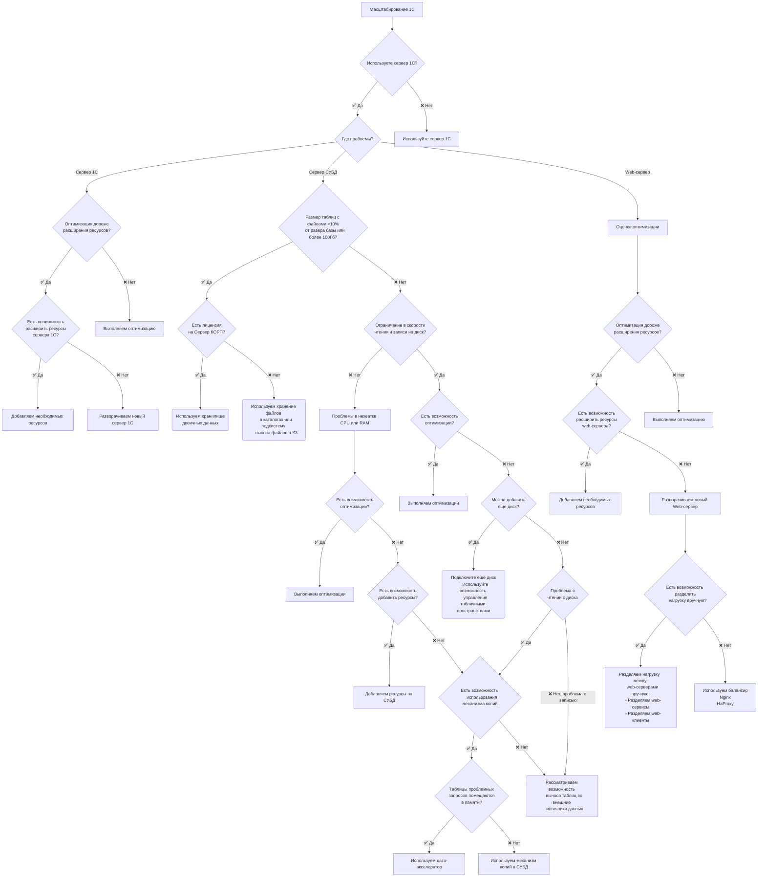

# growth-of-the-1C-system
Диаграмма принятия решения о механике обеспечения роста 1С-системы

```mermaid
graph TD
    A[Масштабирование 1С] --> B{Используете сервер 1С?}
    B -->|✅ Да| C{Где проблемы?}
    B -->|❌ Нет| D[Используйте сервер 1С]

    C --> |Сервер 1C| OС{Оптимизация дороже
    расширения ресурсов?}
    OС --> |✅ Да| СQ{Есть возможность 
    расширить ресурсы 
    сервера 1С?} 
    OС --> |❌ Нет| СQR[Выполняем оптимизацию]
    СQ --> |✅ Да| СR[Добавляем необходимых ресурсов]
    СQ --> |❌ Нет| СN[Разворачиваем новый сервер 1С]


    
    C --> |Сервер СУБД| S{Размер таблиц с файлами >10%
    от разера базы или более 100Гб?}
    S --> |✅ Да| SF{Есть лицензия 
    на Сервер КОРП?}
    SF --> |✅ Да| SFC(Используем хранилище 
    двоичных данных) 
    SF --> |❌ Нет| SFP(Используем хранение файлов 
    в каталогах или подсистему 
    выноса файлов в S3)
    S --> |❌ Нет| SP{Ограничение в скорости 
    чтения и записи на диск?}

    SP --> |❌ Нет| SPC[Проблемы в нехватке CPU или RAM]
    SPC --> SPCO{Есть возможность 
    оптимизации?}
    SPCO --> |✅ Да| SPCOR[Выполняем оптимизации]
    SPCO --> |❌ Нет| SPCA{Есть возможность 
    добавить ресурсы?}
    SPCA --> |✅ Да| SPCAD[Добавляем ресурсы на СУБД]
    SPCA --> |❌ Нет| SPDRC
    
    SP --> |✅ Да| SPDO{Есть возможность
    оптимизации?}
    SPDO --> |✅ Да| SPDOR[Выполняем оптимизации]
    SPDO --> |❌ Нет| SPD{Можно добавить 
    еще диск?}

    SPD--> |✅ Да| SPDD(Подключите еще диск
    Используйте возможность 
    управления табличными пространствами)
    SPD--> |❌ Нет| SPDR{Проблема в 
    чтении с диска}
    SPDR--> |✅ Да| SPDRC{Есть возможность 
    использования механизма копий}
    SPDRC --> |✅ Да| SPDRCY{Таблицы проблемных
    запросов помещаются 
    в памяти?}
    SPDRC --> |❌ Нет| SPDRVI

    
    SPDRCY --> |✅ Да| SPDRCYDA[Используем дата-акселератор]
    SPDRCY --> |❌ Нет| SPDRCYС[Используем механизм копий в СУБД]
    SPDR--> |❌ Нет, проблема с записью| SPDRVI[Рассматриваем возможность 
    выноса таблиц во внешние 
    источники данных]

    
    C --> |Web-сервер| Web[Оценка оптимизации]
    Web --> OW{Оптимизация дороже
    расширения ресурсов?}
    OW --> |✅ Да| WQ{Есть возможность 
    расширить ресурсы 
    web-сервера?} 
    OW --> |❌ Нет| WQR[Выполняем оптимизацию]
    WQ --> |✅ Да| WR[Добавляем необходимых ресурсов]
    WQ --> |❌ Нет| WN[Разворачиваем новый Web-сервер]
    WN --> WNSN{Есть возможность разделить
    нагрузку вручную?}
    WNSN --> |✅ Да| WNSNS[Разделяем нагрузку  между 
    web-серверами вручную:
    ▫️ Разделяем web-сервисы
    ▫️ Разделяем web-клиенты]
    WNSN --> |❌ Нет| WB[Используем балансир 
    Nginx
    HaProxy]
```
